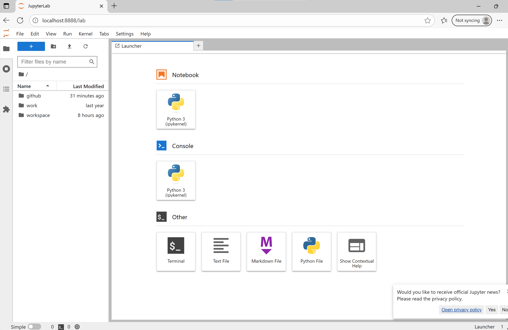

## 📦 Python Docker Lab in a Container

This repository provides a containerized Python environment with JupyterLab, designed for easy setup and consistent development across systems.

---

## Login page demo

Here’s what the app looks like running locally:



## 🚀 Getting Started

### 1. Clone the repository

```bash
git clone https://github.com/vladdsm/python-docker.git
cd python-docker
```

### 2. Configure environment

Create a `.env` file inside the `scripts/` folder:

```env
JUPYTER_PASSWORD=yourStrongPassword123
WORKSPACE=workspace
PY_PORT=8888
```

> You can copy from `scripts/.env.example` if available.

---

### 3. Build the Docker image

```powershell
.\scripts\build.ps1
```

---

### 4. Run the container

```powershell
.\scripts\run.ps1
```

Alternatively, create shortcuts for the run.bat file to launch it from the desktop

This will start the container and open JupyterLab in your browser at `http://localhost:8888`.

---

### 5. Stop the container

```powershell
.\scripts\stop.ps1
```
Alternatively, create shortcuts for the stop.bat file to launch it from the desktop

---

## 📁 Folder Structure

```
python-docker/
├─ Dockerfile
├─ requirements.txt
├─ scripts/
│  ├─ build.ps1
│  ├─ run.ps1
│  ├─ stop.ps1
│  └─ .env
├─ workspace/
```

---

## 🛠 Notes

- The container mounts your local `workspace/` and `Documents/GitHub` folders.
- Password authentication is enabled via `.env`.
- No token is required for login.

---

Let me know if you'd like a badge section, license block, or GitHub Actions setup added later.
